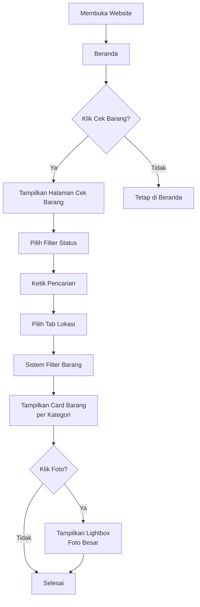
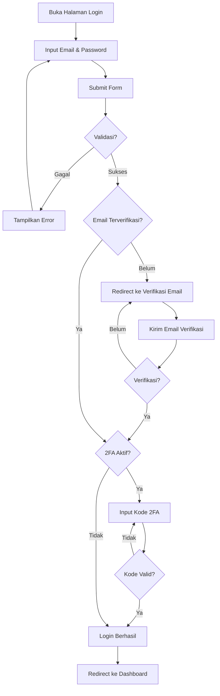
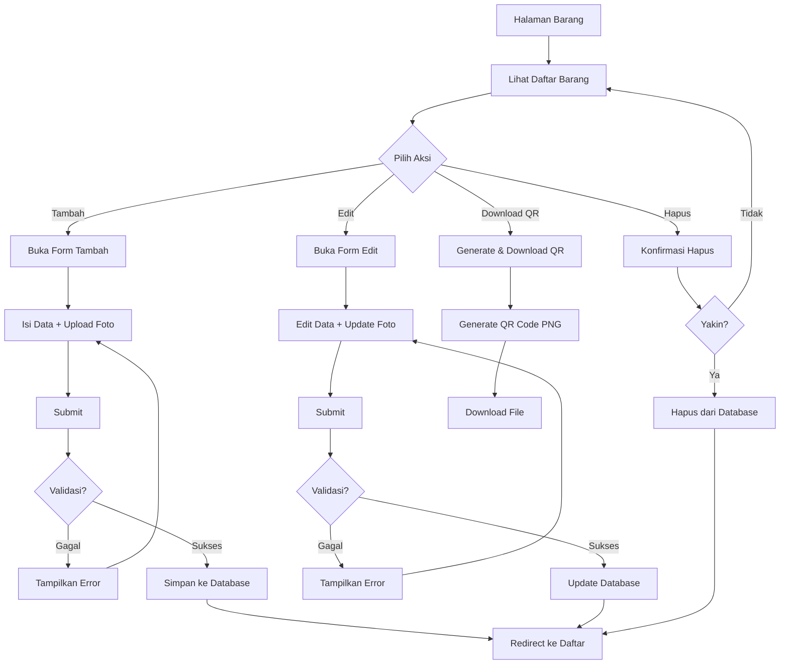
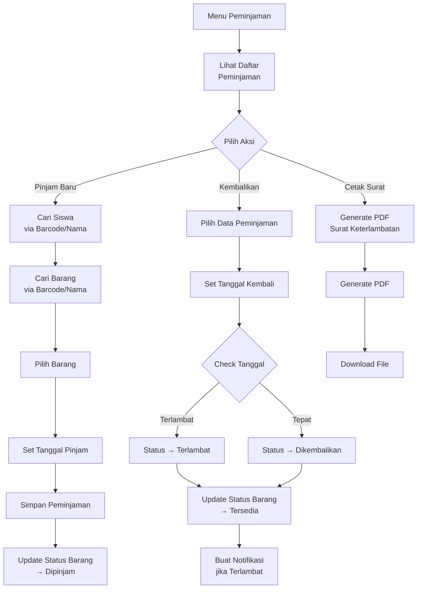
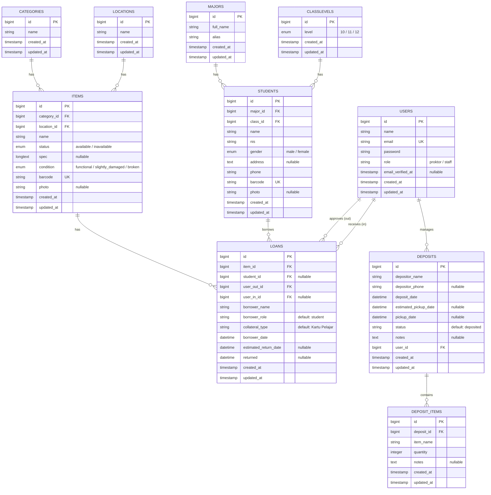

# LAPORAN PRAKTIK KERJA LAPANGAN (PKL)

## SISTEM INFORMASI INVENTARIS BARANG BERBASIS WEB
### (Inventra School Inventory System)

---

**Disusun oleh:**
[Nama Lengkap]
[NIS/NISN]

---

**Tempat PKL:**
[Nama Sekolah/Perusahaan]

**Program Keahlian:**
[Rekayasa Perangkat Lunak / Teknik Komputer dan Informatika]

**Tahun Pelajaran:**
[2025/2026]

---

## KATA PENGANTAR

Puji syukur kehadirat Tuhan Yang Maha Esa atas limpahan rahmat dan karunia-Nya sehingga penulis dapat menyelesaikan laporan Praktik Kerja Lapangan (PKL) ini dengan baik.

Laporan ini disusun sebagai bentuk pertanggungjawaban atas pelaksanaan PKL yang telah dilaksanakan di [Nama Tempat PKL]. Dalam laporan ini, penulis membahas tentang pembangunan Sistem Informasi Inventaris Barang Berbasis Web yang diberi nama "Inventra School".

Penulis menyadari bahwa laporan ini masih jauh dari sempurna. Oleh karena itu, kritik dan saran yang membangun sangat penulis harapkan. Semoga laporan ini dapat bermanfaat bagi pembaca dan menjadi referensi untuk pengembangan selanjutnya.

[Kota], [Tanggal]

Penulis,

**[Nama Lengkap]**

---

## DAFTAR ISI

KATA PENGANTAR ...... i
DAFTAR ISI ...... ii
DAFTAR GAMBAR ...... iii
DAFTAR TABEL ...... iv

BAB I PENDAHULUAN ...... 1
1.1 Latar Belakang ...... 1
1.2 Rumusan Masalah ...... 2
1.3 Tujuan ...... 2
1.4 Manfaat ...... 2
1.5 Batasan Masalah ...... 3

BAB II LANDASAN TEORI ...... 4
2.1 Sistem Informasi ...... 4
2.2 Inventaris Barang ...... 4
2.3 PHP & Laravel ...... 5
2.4 React & Inertia.js ...... 5
2.5 MySQL ...... 6
2.6 Tailwind CSS ...... 6

BAB III PEMBAHASAN ...... 7
3.1 Gambaran Umum Aplikasi ...... 7
3.2 Fitur Aplikasi ...... 7
3.3 Alur Kerja Aplikasi ...... 9
3.4 Arsitektur Sistem ...... 11
3.5 Struktur Database ...... 12
3.6 Implementasi Antarmuka ...... 14

BAB IV PENUTUP ...... 18
4.1 Kesimpulan ...... 18
4.2 Saran ...... 18

DAFTAR PUSTAKA ...... 19

---

## DAFTAR GAMBAR

Gambar 3.1 Tampilan Halaman Cek Barang (Publik) ...... 14
Gambar 3.2 Tampilan Dashboard Admin ...... 15
Gambar 3.3 Tampilan Manajemen Barang ...... 15
Gambar 3.4 Tampilan Form Tambah Barang ...... 16
Gambar 3.5 Tampilan Manajemen Peminjaman ...... 16
Gambar 3.6 Tampilan Notifikasi ...... 17

---

## BAB I
## PENDAHULUAN

### 1.1 Latar Belakang

Perkembangan teknologi informasi telah membawa perubahan besar dalam berbagai aspek kehidupan, termasuk dalam dunia pendidikan. Sekolah sebagai lembaga pendidikan dituntut untuk dapat mengelola berbagai aspek administrasi secara efektif dan efisien. Salah satu aspek penting yang perlu dikelola adalah inventaris barang sekolah.

Inventaris barang sekolah mencakup berbagai aset seperti alat laboratorium, perlengkapan olahraga, alat peraga, buku, dan barang-barang lainnya yang digunakan dalam kegiatan belajar mengajar. Pengelolaan inventaris secara manual menggunakan catatan di buku atau spreadsheet seringkali menimbulkan berbagai masalah, antara lain:

1. Data barang yang tidak terpusat dan sulit diakses
2. Kesulitan dalam melacak status peminjaman barang
3. Sering terjadi kehilangan data karena catatan fisik rusak atau hilang
4. Proses pencatatan peminjaman dan pengembalian yang lambat
5. Sulitnya mengetahui barang apa saja yang tersedia atau sedang dipinjam

Berdasarkan permasalahan tersebut, diperlukan sebuah sistem informasi inventaris barang berbasis web yang dapat membantu sekolah dalam mengelola aset-asetnya secara digital. Sistem ini memungkinkan pencatatan data barang, peminjaman, pengembalian, dan pengecekan status barang secara real-time dan terpusat.

### 1.2 Rumusan Masalah

Berdasarkan latar belakang di atas, rumusan masalah dalam laporan ini adalah:

1. Bagaimana merancang dan membangun sistem informasi inventaris barang berbasis web yang efektif?
2. Bagaimana mengimplementasikan fitur peminjaman dan pengembalian barang secara digital?
3. Bagaimana menyediakan antarmuka publik bagi siswa untuk mengecek ketersediaan barang?
4. Bagaimana mengintegrasikan teknologi QR code untuk memudahkan identifikasi barang?

### 1.3 Tujuan

Tujuan dari pembuatan aplikasi ini adalah:

1. Membangun sistem informasi inventaris barang berbasis web yang terpusat dan mudah diakses
2. Memudahkan proses pencatatan peminjaman dan pengembalian barang
3. Menyediakan halaman publik bagi siswa untuk melihat status ketersediaan barang
4. Mengimplementasikan QR code sebagai identitas unik setiap barang
5. Menyediakan fitur notifikasi untuk peminjaman yang terlambat

### 1.4 Manfaat

Manfaat yang diharapkan dari aplikasi ini adalah:

1. **Bagi Sekolah**: Memudahkan pengelolaan inventaris barang secara keseluruhan
2. **Bagi Staff/Proktor**: Mempercepat proses administrasi pencatatan barang dan peminjaman
3. **Bagi Siswa**: Memudahkan pengecekan ketersediaan barang tanpa harus datang langsung
4. **Bagi Penulis**: Menambah pengalaman dalam pengembangan aplikasi web full-stack

### 1.5 Batasan Masalah

Batasan masalah dalam laporan ini adalah:

1. Aplikasi berbasis web dan diakses melalui browser
2. Menggunakan framework Laravel 12 untuk backend dan React 19 untuk frontend
3. Database menggunakan MySQL
4. Fokus pada manajemen barang, peminjaman, dan titipan barang
5. Tidak membahas sistem akuntansi atau keuangan
6. Tidak membahas sistem pembelian barang

---

## BAB II
## LANDASAN TEORI

### 2.1 Sistem Informasi

Sistem informasi adalah kombinasi dari teknologi informasi dan aktivitas manusia yang menggunakan teknologi untuk mendukung operasi dan manajemen. Dalam konteks inventaris barang, sistem informasi berfungsi untuk mengumpulkan, menyimpan, mengolah, dan menyajikan data barang secara terstruktur sehingga memudahkan pengambilan keputusan.

### 2.2 Inventaris Barang

Inventaris barang adalah daftar lengkap semua aset atau barang yang dimiliki oleh suatu organisasi atau lembaga. Dalam lingkungan sekolah, inventaris mencakup barang-barang seperti meja, kursi, komputer, alat praktikum, buku, dan perlengkapan lainnya. Pengelolaan inventaris yang baik meliputi pencatatan, pemeliharaan, dan pelacakan status barang.

### 2.3 PHP & Laravel

**PHP** (Hypertext Preprocessor) adalah bahasa pemrograman server-side yang banyak digunakan untuk pengembangan web. PHP digunakan untuk membangun aplikasi web dinamis dengan kemampuannya berinteraksi dengan database.

**Laravel** adalah framework PHP yang menggunakan arsitektur MVC (Model-View-Controller). Laravel menyediakan berbagai fitur seperti:
- **Eloquent ORM** — Object-Relational Mapping untuk interaksi database dengan sintaks yang ekspresif
- **Blade** — Template engine (digantikan React/Inertia dalam proyek ini)
- **Artisan Console** — CLI untuk menjalankan tugas-tugas seperti migrasi, seeding, dan pembuatan kode
- **Routing** — Sistem routing yang fleksibel
- **Middleware & Authentication** — Sistem keamanan dan autentikasi bawaan

Dalam proyek ini, Laravel versi 12 digunakan sebagai backend API sekaligus server-side rendering melalui Inertia.js.

### 2.4 React & Inertia.js

**React** adalah library JavaScript untuk membangun antarmuka pengguna (UI). React menggunakan konsep komponen yang dapat digunakan kembali, state management, dan Virtual DOM untuk rendering yang efisien. Dalam proyek ini menggunakan React versi 19.

**Inertia.js** adalah pendekatan baru untuk membangun aplikasi web single-page application (SPA) tanpa perlu membangun API secara terpisah. Inertia memungkinkan pengembang menggunakan framework backend (Laravel) untuk routing dan data, sementara frontend menggunakan framework JavaScript (React) untuk rendering.

Keunggulan Inertia.js:
- Tidak memerlukan pembuatan REST API secara eksplisit
- Routing tetap di backend (Laravel)
- Data dikirim langsung dari controller ke komponen React
- Mendukung fitur seperti form submission, validasi, dan flash messages secara native

### 2.5 MySQL

MySQL adalah sistem manajemen basis data relasional (RDBMS) yang bersifat open-source. MySQL menggunakan bahasa SQL (Structured Query Language) untuk mengelola data. MySQL dipilih karena performanya yang baik, stabil, dan banyak digunakan di berbagai aplikasi web.

### 2.6 Tailwind CSS

Tailwind CSS adalah framework CSS utility-first yang memungkinkan pengembang membangun antarmuka pengguna dengan cepat menggunakan kelas-kelas utilitas yang sudah tersedia. Dalam proyek ini menggunakan Tailwind CSS versi 4.

Teknologi pendukung lainnya:
- **Laravel Fortify** — Backend autentikasi headless (login, register, 2FA, verifikasi email)
- **Laravel Wayfinder** — Generate fungsi TypeScript untuk route Laravel
- **QR Code** — Menggunakan library chillerlan/php-qrcode untuk generate QR code
- **DOM PDF** — Menggunakan barryvdh/laravel-dompdf untuk generate PDF

---

## BAB III
## PEMBAHASAN

### 3.1 Gambaran Umum Aplikasi

**Inventra School** adalah sistem informasi inventaris barang berbasis web yang dibangun menggunakan Laravel 12, React 19, dan Inertia.js. Aplikasi ini dirancang untuk membantu sekolah dalam mengelola inventaris barang secara digital, mencakup pencatatan barang, peminjaman, pengembalian, dan pengecekan status barang.

Aplikasi memiliki dua sisi pengguna:
1. **Sisi Publik** — Dapat diakses tanpa login, menampilkan daftar barang dengan filter lokasi, kategori, dan status ketersediaan
2. **Sisi Admin** — Membutuhkan login, terdiri dari role Staff dan Proktor dengan wewenang yang berbeda

### 3.2 Fitur Aplikasi

#### A. Manajemen Barang
- CRUD (Create, Read, Update, Delete) data barang
- Upload foto barang
- Kategori barang (misal: Alat Laboratorium, Alat Olahraga, dll)
- Lokasi penyimpanan barang (misal: Lab IPA, Perpustakaan, dll)
- Status ketersediaan (Tersedia / Dipinjam)
- Kondisi barang (Baik / Rusak Ringan / Rusak)
- Generate QR Code otomatis untuk setiap barang
- Download QR Code per item atau dalam bentuk ZIP

#### B. Manajemen Peminjaman
- Pencatatan peminjaman barang oleh siswa
- Pencatatan pengembalian barang
- Status peminjaman (dipinjam / dikembalikan / terlambat)
- Cetak surat peringatan keterlambatan dalam format PDF
- Riwayat peminjaman

#### C. Manajemen Titipan Barang
- Pencatatan barang titipan siswa
- Status pengambilan barang titipan
- Riwayat titipan

#### D. Manajemen Siswa
- CRUD data siswa
- Upload foto siswa
- Generate QR Code untuk identitas siswa
- Import data dari Excel
- Export data ke Excel

#### E. Master Data
- Manajemen Lokasi penyimpanan barang
- Manajemen Kategori barang
- Manajemen Kelas
- Manajemen Jurusan
- Manajemen Wali Kelas (khusus Proktor)

#### F. Manajemen User
- CRUD user staff/proktor (khusus Proktor)
- Dua role: Proktor (admin utama) dan Staff

#### G. Halaman Publik (Cek Barang)
- Menampilkan semua barang dalam bentuk card
- Filter by status (Semua / Tersedia / Dipinjam)
- Filter by lokasi (tab)
- Pencarian barang (search by name)
- Pengelompokan barang per kategori
- Lightbox untuk melihat foto barang secara besar

#### H. Notifikasi
- Notifikasi peminjaman yang terlambat
- Mark as read / mark all as read

#### I. Autentikasi & Keamanan
- Login dan Register
- Verifikasi email
- Two-Factor Authentication (2FA)
- Reset password
- Gates & Middleware untuk otorisasi

### 3.3 Alur Kerja Aplikasi

#### Alur Publik (Tanpa Login)

```
Pengunjung → Buka Website
  ├─ Beranda (Welcome Page)
  └─ Klik "Cek Barang"
       ├─ Lihat statistik (Tersedia / Dipinjam)
       ├─ Pilih filter status (Semua / Tersedia / Dipinjam)
       ├─ Ketik kata kunci di kolom pencarian
       ├─ Pilih tab lokasi
       │    └─ Barang dikelompokkan per kategori
       │         └─ Setiap barang tampil sebagai card
       │              └─ Klik foto → Lihat foto besar (Lightbox)
       └─ Klik "Staff Login" → Halaman login
```

#### Alur Admin (Setelah Login)

```
Staff/Proktor → Login
  ├─ Dashboard (Ringkasan data)
  ├─ Manajemen Barang
  │    ├─ Lihat daftar barang
  │    ├─ Tambah Barang (isi form + upload foto)
  │    ├─ Edit Barang
  │    └─ Hapus Barang
  ├─ Manajemen Peminjaman
  │    ├─ Lihat daftar peminjaman
  │    ├─ Catat Peminjaman Baru (pilih siswa + pilih barang)
  │    ├─ Kembalikan Barang
  │    ├─ Cetak Surat Keterlambatan PDF
  │    └─ Hapus data peminjaman
  ├─ Manajemen Titipan Barang
  │    ├─ Catat Titipan Baru
  │    ├─ Pengambilan Barang
  │    └─ Hapus data titipan
  ├─ Manajemen Siswa
  │    ├─ CRUD siswa
  │    ├─ Import Excel
  │    ├─ Export Excel
  │    └─ Download QR Code siswa
  ├─ Master Data (Lokasi, Kategori, Kelas, Jurusan, Wali Kelas)
  ├─ Manajemen User (khusus Proktor)
  └─ Notifikasi
       └─ Lihat dan tandai notifikasi
```

### 3.4 Arsitektur Sistem

Aplikasi menggunakan arsitektur **Monolith dengan SPA Frontend** melalui Inertia.js.

```
┌─────────────────────────────────────────────────────────────┐
│                        Browser                               │
│  ┌───────────────────────────────────────────────────────┐  │
│  │              React SPA (Inertia.js)                   │  │
│  │  - Komponen React                                      │  │
│  │  - Inertia Link & Form                                 │  │
│  │  - State Management (useState, useForm)                │  │
│  └───────────────┬───────────────────────────────────────┘  │
│                  │ HTTP (JSON + HTML)                        │
└──────────────────┼──────────────────────────────────────────┘
                   │
┌──────────────────┼──────────────────────────────────────────┐
│                  ▼                                           │
│  Laravel 12 Backend                                         │
│  ┌───────────────────────────────────────────────────────┐  │
│  │  Routes (web.php)                                     │  │
│  │  Middleware (auth, verified, can:proktor)              │  │
│  │  Controllers (Item, Student, Loan, Deposit, dll)      │  │
│  │  Form Requests (Validasi)                              │  │
│  │  Models (Eloquent ORM)                                 │  │
│  │  Gates & Policies                                      │  │
│  └───────────────────────┬───────────────────────────────┘  │
│                          ▼                                   │
│  ┌───────────────────────────────────────────────────────┐  │
│  │  Database (MySQL)                                     │  │
│  │  - items, categories, locations                       │  │
│  │  - students, loans, deposits                          │  │
│  │  - users, notifications                               │  │
│  └───────────────────────────────────────────────────────┘  │
│                                                              │
│  Storage (Public)                                            │
│  - storage/app/public/items/ (foto barang)                   │
│  - storage/app/public/students/ (foto siswa)                 │
└──────────────────────────────────────────────────────────────┘
```

**Alur Request-Response:**

1. User mengklik link atau submit form
2. Inertia.js mengirim request ke server Laravel
3. Laravel memproses request (middleware → controller → database)
4. Controller me-render Inertia page dengan data
5. Server mengirim response JSON berisi komponen + props
6. Inertia.js di browser me-render komponen React dengan data yang diterima

### 3.5 Flowchart Aplikasi

#### 3.5.1 Flowchart Cek Barang (Publik)



#### 3.5.2 Flowchart Login & Autentikasi



#### 3.5.3 Flowchart CRUD Barang (Admin)



#### 3.5.4 Flowchart Peminjaman Barang



### 3.6 Entity Relationship Diagram (ERD)



### 3.7 Struktur Database

#### Tabel: `items`
| Kolom | Tipe | Keterangan |
|-------|------|------------|
| id | bigint (PK) | Primary key |
| category_id | bigint (FK) | Relasi ke categories |
| location_id | bigint (FK) | Relasi ke locations |
| name | string | Nama barang |
| status | enum | 'available', 'inavailable' |
| spec | longtext (nullable) | Spesifikasi barang |
| condition | enum | 'functional', 'slightly_damaged', 'broken' |
| barcode | string (unique) | Kode unik (UUID) |
| photo | string (nullable) | Path foto barang |
| created_at | timestamp | Waktu dibuat |
| updated_at | timestamp | Waktu diupdate |

#### Tabel: `students`
| Kolom | Tipe | Keterangan |
|-------|------|------------|
| id | bigint (PK) | Primary key |
| major_id | bigint (FK) | Relasi ke majors |
| class_id | bigint (FK) | Relasi ke classlevels |
| name | string | Nama siswa |
| nis | string | Nomor Induk Siswa |
| gender | enum | 'male', 'female' |
| address | text (nullable) | Alamat |
| phone | string | Nomor telepon |
| barcode | string (unique) | Kode unik |
| photo | string (nullable) | Path foto siswa |

#### Tabel: `loans`
| Kolom | Tipe | Keterangan |
|-------|------|------------|
| id | bigint (PK) | Primary key |
| student_id | bigint (FK) | Relasi ke students |
| item_id | bigint (FK) | Relasi ke items |
| loan_date | datetime | Tanggal pinjam |
| return_date | datetime (nullable) | Tanggal kembali |
| status | enum | 'borrowed', 'returned', 'overdue' |
| notes | text (nullable) | Catatan |

#### Tabel: `categories`
| Kolom | Tipe | Keterangan |
|-------|------|------------|
| id | bigint (PK) | Primary key |
| name | string | Nama kategori |

#### Tabel: `locations`
| Kolom | Tipe | Keterangan |
|-------|------|------------|
| id | bigint (PK) | Primary key |
| name | string | Nama lokasi |

#### Tabel: `users`
| Kolom | Tipe | Keterangan |
|-------|------|------------|
| id | bigint (PK) | Primary key |
| name | string | Nama user |
| email | string (unique) | Email |
| password | string | Password (bcrypt) |
| role | enum | 'proktor', 'staff' |
| email_verified_at | timestamp (nullable) | Verifikasi email |

### 3.6 Implementasi Antarmuka

#### Halaman Cek Barang (Publik)
Halaman ini menampilkan barang dalam bentuk card grid. Pengguna dapat:
- Memilih filter status (Semua, Tersedia, Dipinjam) melalui dropdown
- Mencari barang berdasarkan nama
- Memilih lokasi melalui tab buttons
- Melihat barang yang dikelompokkan per kategori
- Mengklik foto barang untuk melihat dalam ukuran besar (lightbox)

#### Halaman Dashboard
Menampilkan ringkasan data seperti jumlah barang, peminjaman aktif, siswa, dan notifikasi.

#### Halaman Manajemen Barang
Menampilkan daftar barang dalam bentuk tabel dengan fitur pencarian, filter, dan tombol aksi (edit, hapus, download barcode).

#### Halaman Form Tambah/Edit Barang
Form input untuk menambahkan atau mengedit data barang, termasuk upload foto, pilih kategori, lokasi, status, dan kondisi.

#### Halaman Manajemen Peminjaman
Daftar peminjaman dengan status, tombol pengembalian, dan cetak surat keterlambatan PDF.

#### Halaman Notifikasi
Daftar notifikasi peminjaman terlambat dengan tombol tandai sudah dibaca.

---

## BAB IV
## PENUTUP

### 4.1 Kesimpulan

Berdasarkan hasil pembahasan dan implementasi Sistem Informasi Inventaris Barang "Inventra School", dapat disimpulkan:

1. Aplikasi berhasil dibangun menggunakan Laravel 12, React 19, dan Inertia.js sebagai teknologi utama
2. Fitur manajemen barang, peminjaman, titipan, dan master data dapat berfungsi sesuai kebutuhan sekolah
3. Halaman publik cek barang memudahkan siswa untuk melihat ketersediaan barang secara real-time
4. QR code pada setiap barang memudahkan identifikasi dan pelacakan
5. Sistem notifikasi membantu staff dalam memantau peminjaman yang terlambat

### 4.2 Saran

Untuk pengembangan selanjutnya, disarankan:

1. Menambahkan fitur export laporan dalam format Excel/PDF yang lebih lengkap
2. Integrasi dengan sistem SMS atau WhatsApp untuk notifikasi otomatis
3. Pengembangan aplikasi mobile untuk memudahkan akses
4. Penambahan fitur pemeliharaan barang (maintenance schedule)
5. Sistem backup data otomatis

---

## DAFTAR PUSTAKA

1. Laravel Documentation. (2025). *Laravel 12 Documentation*. https://laravel.com/docs/12.x
2. React Documentation. (2025). *React 19 Documentation*. https://react.dev/
3. Inertia.js Documentation. (2025). *Inertia.js v2 Guide*. https://inertiajs.com/
4. Tailwind CSS Documentation. (2025). *Tailwind CSS v4 Documentation*. https://tailwindcss.com/docs
5. Fortify Documentation. (2025). *Laravel Fortify*. https://laravel.com/docs/12.x/fortify
6. Supono, & Putratama, V. (2018). *Pemrograman Web dengan Menggunakan PHP dan Framework Laravel*. Yogyakarta: Deepublish.
7. Siregar, M. R., & Nasution, M. I. P. (2020). *Sistem Informasi Inventaris Barang Berbasis Web*. Jurnal Sistem Informasi, 8(2), 123-132.

---

**Catatan:** [Nama], [Tempat], [tanggal], dan bagian lain yang ditandai dengan kurung siku `[]` harap diisi sesuai data PKL masing-masing.
