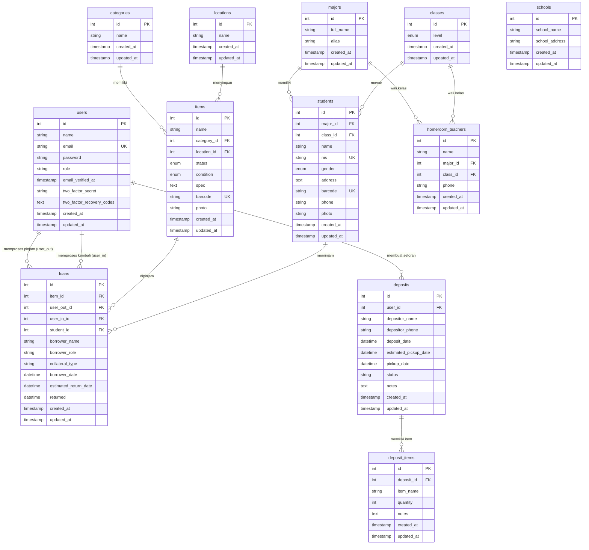

# ERD (Entity Relationship Diagram)

## Diagram ERD Lengkap

## Hubungan Antar Tabel

| Tabel Asal | Relasi | Tabel Tujuan | Keterangan |
|------------|--------|--------------|------------|
| users | 1:* | loans | User memproses peminjaman (user_out) |
| users | 1:* | loans | User memproses pengembalian (user_in) |
| users | 1:* | deposits | User membuat setoran |
| categories | 1:* | items | Satu kategori memiliki banyak barang |
| locations | 1:* | items | Satu lokasi menyimpan banyak barang |
| items | 1:* | loans | Satu barang dipinjam banyak kali |
| majors | 1:* | students | Satu jurusan memiliki banyak siswa |
| classes | 1:* | students | Satu kelas memiliki banyak siswa |
| students | 1:* | loans | Satu siswa meminjam banyak kali |
| majors | 1:* | homeroom_teachers | Satu jurusan punya wali kelas |
| classes | 1:* | homeroom_teachers | Satu kelas punya wali kelas |
| deposits | 1:* | deposit_items | Satu setoran punya banyak item |
