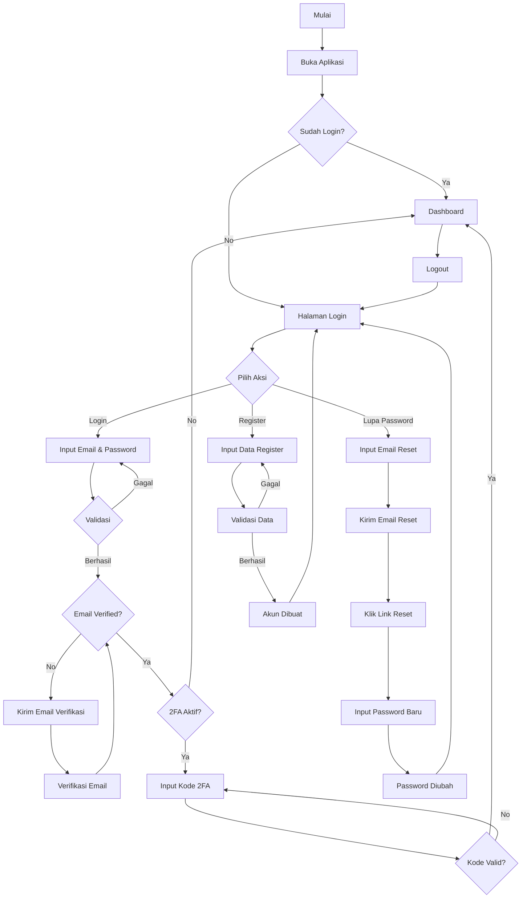
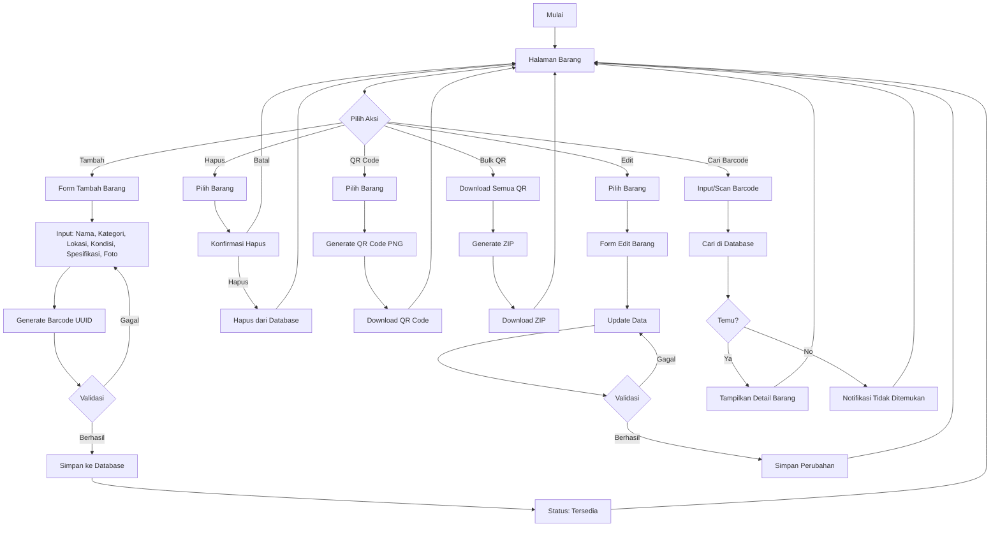
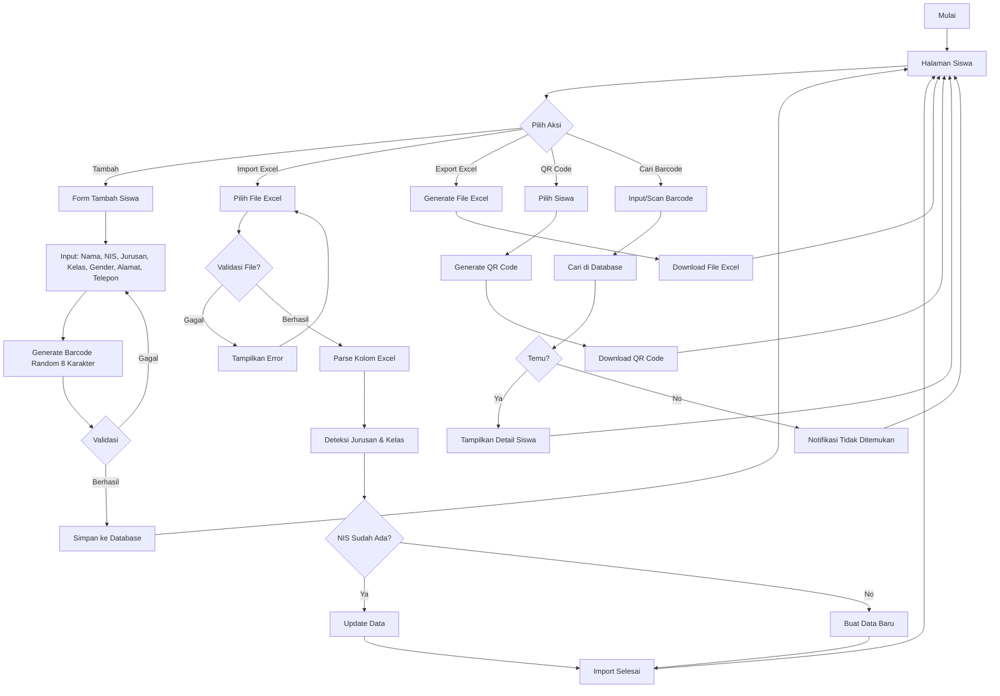
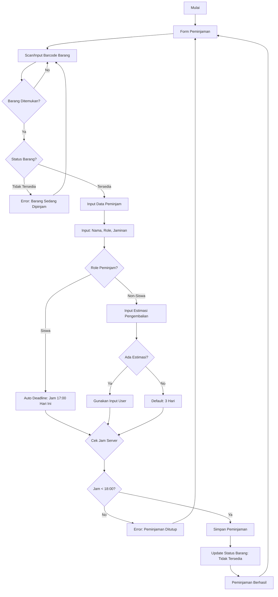
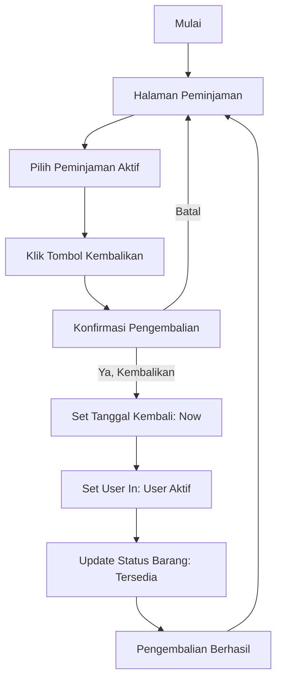
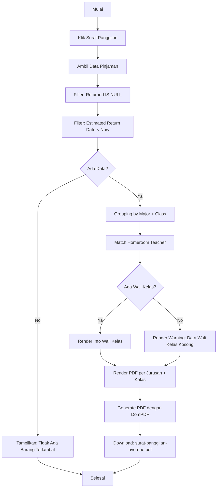
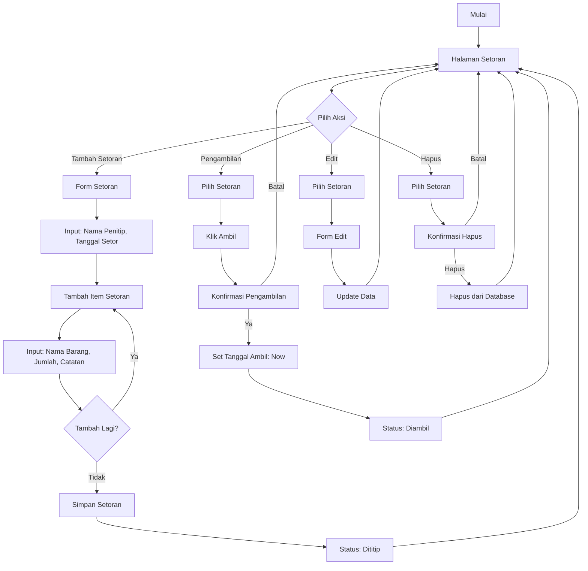
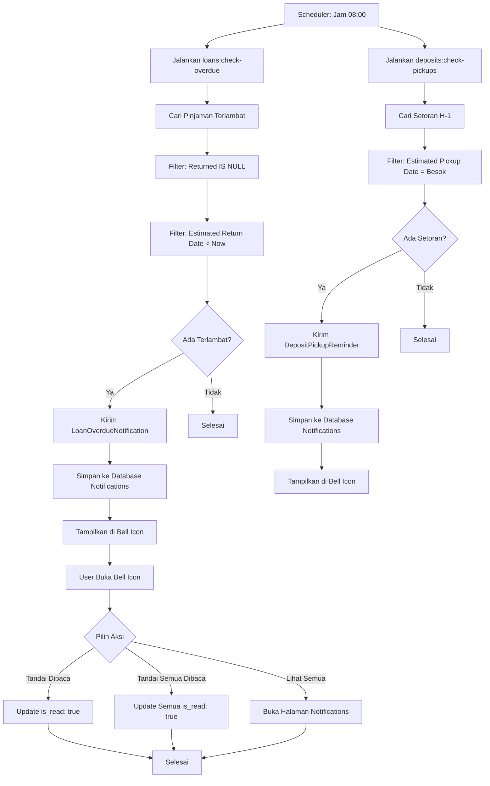
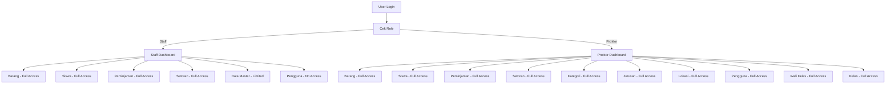
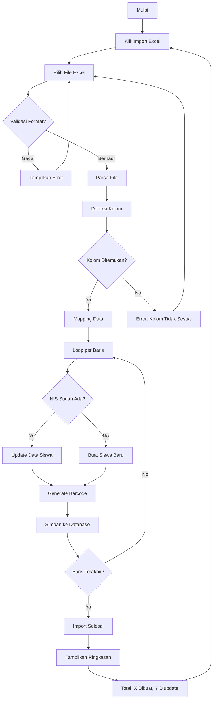

# Flowchart Sistem Inventra School

## 1. Flowchart Autentikasi

## 2. Flowchart Manajemen Barang

## 3. Flowchart Manajemen Siswa

## 4. Flowchart Peminjaman Barang

## 5. Flowchart Pengembalian Barang

## 6. Flowchart Surat Panggilan

## 7. Flowchart Setoran Barang

## 8. Flowchart Sistem Notifikasi

## 9. Flowchart Login & Role Akses

## 10. Flowchart Import Excel Siswa

